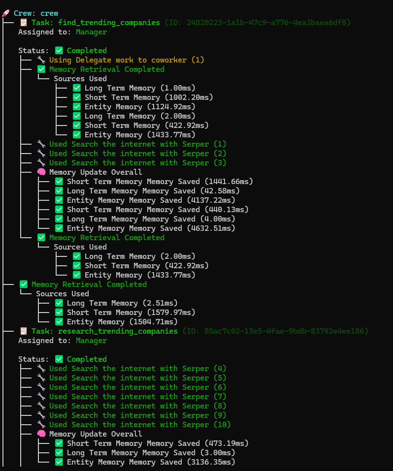

# StockPicker Crew

Welcome to the **StockPicker Crew** project, powered by [crewAI](https://crewai.com).  
This application demonstrates how multiple AI agents can collaborate to analyze financial news, research companies, and pick the best stock for investment decisions.

The crew leverages:

- **Hierarchical multi-agent orchestration**
- **Integrated web search tools** (SerperDevTool)
- **Push notifications** for decision alerts
- **Memory layers** (long-term, short-term RAG, and entity memory) for contextual intelligence

---

## Installation

Ensure you have **Python >=3.10 <3.14** installed.

This project uses [UV](https://docs.astral.sh/uv/) for dependency management.

Install UV if not already installed:

```bash
pip install uv
```

Navigate to your project directory and install dependencies:

```bash
crewai install
```

### Environment Setup

Add your required keys to a `.env` file:

```bash
OPENAI_API_KEY=your_openai_key
SERPER_API_KEY=your_serper_key
PUSHOVER_TOKEN=your_pushover_token
PUSHOVER_USER=your_pushover_user
```

---

## Running the Project

To launch your crew of agents:

```bash
crewai run
```

## Screenshot



By default, outputs will be saved to the `output/` folder:

- `output/trending_companies.json` → List of trending companies
- `output/research_report.json` → Detailed analysis of companies
- `output/decision.md` → Final investment pick and rationale

---

## Understanding Your Crew

The **StockPicker Crew** is composed of specialized AI agents that collaborate under a **Manager agent** using a **hierarchical process**.

### Agents

- **Trending Company Finder**

  - Role: Financial News Analyst
  - Finds 2–3 trending companies in the target sector using SerperDevTool.
  - Avoids repeating previously picked companies.

- **Financial Researcher**

  - Role: Senior Financial Researcher
  - Produces comprehensive company analysis (market position, outlook, investment potential).

- **Stock Picker**

  - Role: Equity Selector
  - Chooses the single best investment candidate.
  - Sends a push notification to the user with a 1-sentence rationale.
  - Produces a detailed markdown report.

- **Manager**
  - Delegates tasks across agents.
  - Ensures the process flows toward a final investment decision.

### Tasks

- **Find Trending Companies** → `output/trending_companies.json`
- **Research Companies** → `output/research_report.json`
- **Pick Best Company** → `output/decision.md`

### Memory Layers

- **Long-Term Memory (SQLite)** → Persists context across sessions.
- **Short-Term Memory (RAG)** → Tracks active session knowledge.
- **Entity Memory (RAG)** → Maintains knowledge about specific companies/entities.

---

## Example Flow

1. Manager delegates to **Trending Company Finder** → finds hot companies in a sector.
2. **Financial Researcher** performs deep dives.
3. **Stock Picker** selects the best one, sends a **push notification**, and generates a markdown report.
4. Manager ensures smooth orchestration.
